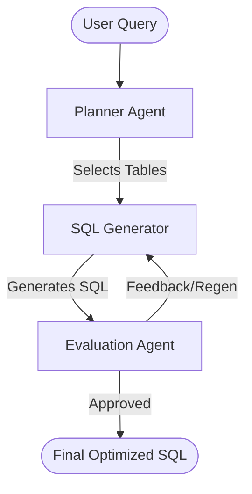

# Agentic SQL: Multi-Agent NLP-to-SQL System 🤖

A sophisticated full-stack application that leverages **LangGraph** and **Groq/Mistral LLMs** to convert natural language queries into optimized SQL. The system uses a multi-agent orchestration to plan, generate, and evaluate SQL queries against a complex retail database schema.

## 🌟 Key Features

- **Multi-Agent Orchestration**: Powered by LangGraph for robust workflow management.
  - **Planner Agent**: Routes queries to relevant table categories.
  - **SQL Generator**: Converts intent to PostgreSQL.
  - **Evaluation Agent**: Validates syntax, accuracy, and performance.
- **Full-Stack Experience**:
  - **FastAPI Backend**: High-performance Python API.
  - **Modern UI**: Interactive dashboard with agent traces, schema viewer, and real-time feedback.
- **Deep Insights**: Collapsible agent logs show the "thinking" process, including tool calls and unoptimized vs. optimized SQL history.
- **Schema Visualizer**: Built-in 15-table schema viewer organized by retail categories.

---

## 🏗️ System Architecture



---

## 🚀 Getting Started

### 1. Prerequisites
- Python 3.9+
- Node.js (Optional, for serving frontend)
- API Keys for **Groq** (Primary) or **Mistral** (Fallback)

### 2. Backend Setup
Navigate to the `backend` directory and install dependencies:

```bash
cd backend
pip install -r requirements.txt
```

Create a `.env` file in the `backend` directory:
```env
GROQ_API_KEY=your_groq_key_here
MISTRAL_API_KEY=your_mistral_key_here
```

Start the FastAPI server:
```bash
python main.py
```
The backend will run on `http://127.0.0.1:8000`.

### 3. Frontend Setup
Navigate to the `frontend` directory. You can serve it using any static file server:

```bash
cd frontend
npx serve .
# OR
python -m http.server 3000
```
Open your browser at `http://localhost:3000`.

---

## 📂 Project Structure

- `backend/`: FastAPI application and agent logic.
  - `sql_agent.py`: LangGraph implementation of the agents.
  - `llm_client.py`: Singleton client for Groq/Mistral management.
  - `main.py`: API endpoints and server configuration.
- `frontend/`: Vanilla JS dashboard.
  - `index.html`: Dashboard layout.
  - `style.css`: Glassmorphic UI styles.
  - `script.js`: UI logic and API integration.
- `retail_schema.sql`: Full DDL for the 15-table retail database.

---

## 📊 Agent Logic & Traces

The UI provides a dedicated **Agent Logs** section where you can monitor:
- **Planner Reasoning**: Why specific tables were chosen.
- **Tool Calls**: Which backend functions were triggered.
- **SQL History**: View every attempt made by the generator before arriving at the final query.
- **Evaluator Feedback**: Detailed scores for accuracy and optimization.

---

## 🛡️ Security
Sensitive information like API keys are managed via environment variables and are excluded from version control via `.gitignore`.

## 📜 License
MIT License.
